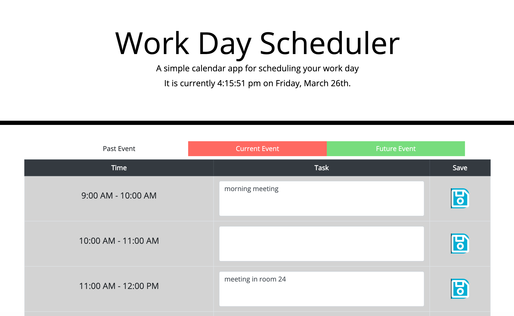

# Work Day Scheduler
This application allows users to type events into their schedule. It is color-coded to show past, current, and future hours.

# Technologies Use
HTML
CSS
JavaScript

## User Story

```
AS AN employee with a busy schedule
I WANT to add important events to a daily planner
SO THAT I can manage my time effectively
```

## Acceptance Criteria

```
GIVEN I am using a daily planner to create a schedule:
1. WHEN I open the planner,
    THEN the current day is displayed at the top of the calendar.
2. WHEN I scroll down,
    THEN I am presented with timeblocks for standard business hours.
3. WHEN I view the timeblocks for that day,
    THEN each timeblock is color coded to indicate whether it is in the past, present, or future.
4. WHEN I click into a timeblock,
    THEN I can enter an event.
5. WHEN I click the save button for that timeblock,
    THEN the text for that event is saved in local storage.
6. WHEN I refresh the page,
    THEN the saved events persist.
```

## Mock-Up

The following screenshots demonstrate the application functionality: 



## Deployed Application
[Deployed Application](https://crsmith01.github.io/homework5-day-planner)

### Contact:
* [Catherine Smith](https://github.com/crsmith01)

## License
 
Copyright 2021 Catherine Smith

Permission is hereby granted, free of charge, to any person obtaining a copy of this software and associated documentation files (the "Software"), to deal in the Software without restriction, including without limitation the rights to use, copy, modify, merge, publish, distribute, sublicense, and/or sell copies of the Software, and to permit persons to whom the Software is furnished to do so, subject to the following conditions:

The above copyright notice and this permission notice shall be included in all copies or substantial portions of the Software.

THE SOFTWARE IS PROVIDED "AS IS", WITHOUT WARRANTY OF ANY KIND, EXPRESS OR IMPLIED, INCLUDING BUT NOT LIMITED TO THE WARRANTIES OF MERCHANTABILITY, FITNESS FOR A PARTICULAR PURPOSE AND NONINFRINGEMENT. IN NO EVENT SHALL THE AUTHORS OR COPYRIGHT HOLDERS BE LIABLE FOR ANY CLAIM, DAMAGES OR OTHER LIABILITY, WHETHER IN AN ACTION OF CONTRACT, TORT OR OTHERWISE, ARISING FROM, OUT OF OR IN CONNECTION WITH THE SOFTWARE OR THE USE OR OTHER DEALINGS IN THE SOFTWARE.
